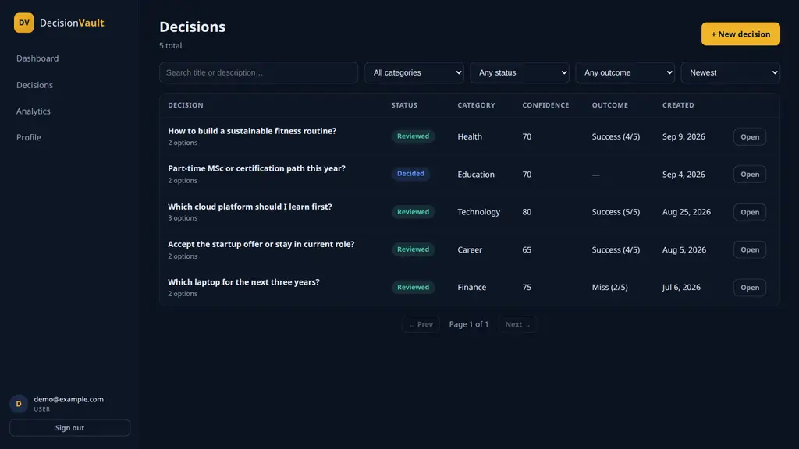
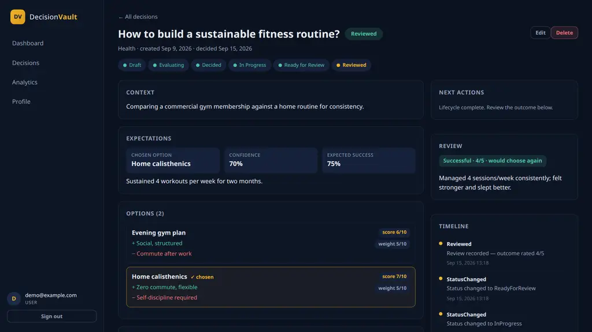
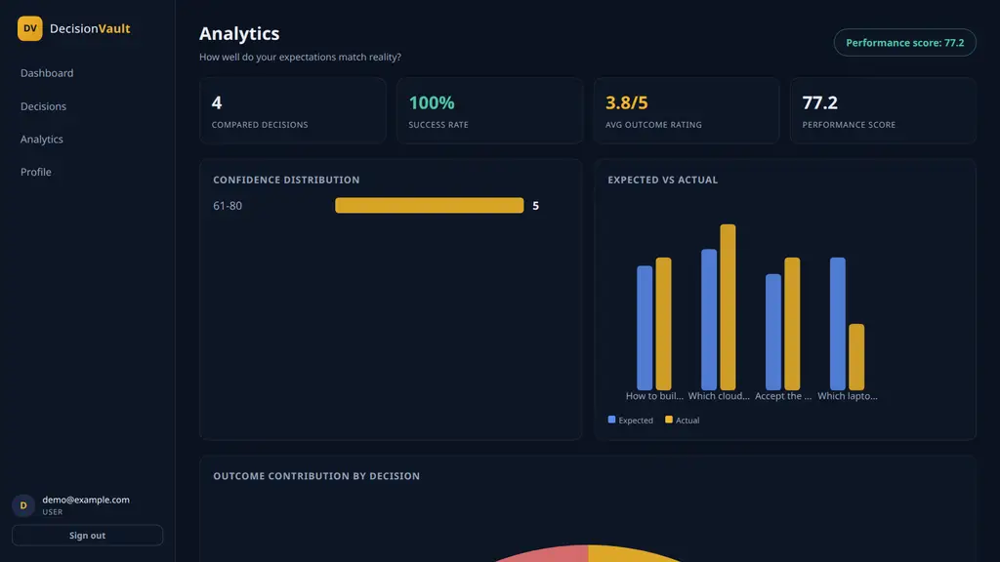
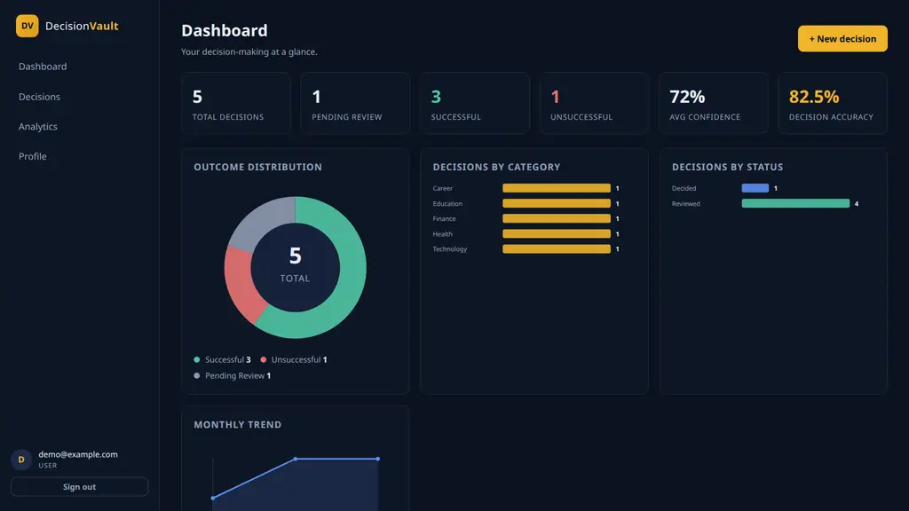
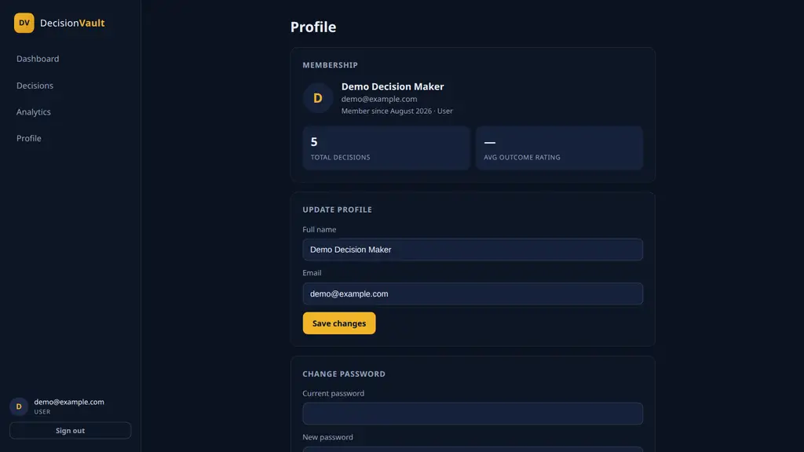
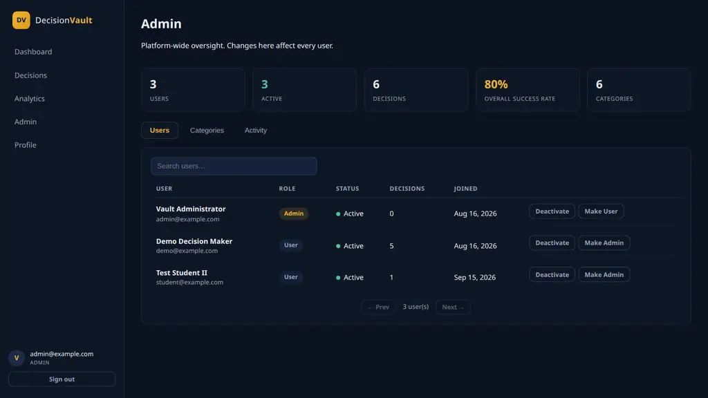
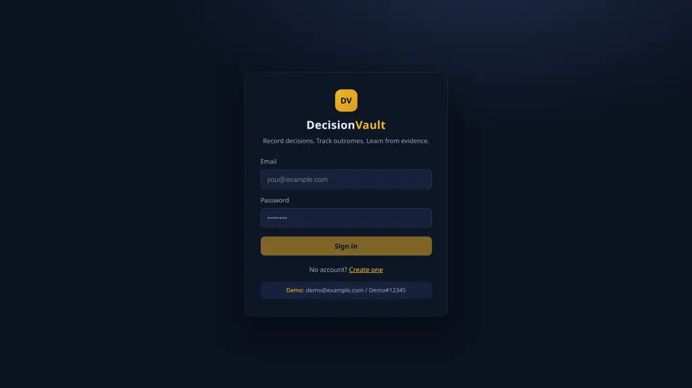

# DecisionVault


**Decision Intelligence & Outcome Tracking Platform**

A full-stack web application for making decisions deliberately and learning from them:
record an important decision, preserve the alternatives and reasoning, commit with an
explicit confidence level, execute, then review what actually happened. The platform
scores how well reality matched expectations and aggregates lifetime decision quality
into dashboard and analytics views.

> DecisionVault was developed by Dhimahi Mehta as an internship/academic project to
> apply the technologies and concepts learned during the TatvaSoft Summer Internship
> Program 2026. It is not commissioned, deployed, or endorsed by TatvaSoft.

---

## About the Project

People make important decisions but rarely preserve the thinking behind them:

- alternatives considered
- reasoning (pros / cons / notes)
- confidence at the moment of choice
- expected outcomes
- actual outcomes
- lessons learned

DecisionVault turns each decision into a structured record with a validated lifecycle,
then closes the loop with reviews and analytics so the historical record becomes usable
feedback.

**Core lifecycle:** `THINK → DECIDE → RECORD → EXECUTE → REVIEW → LEARN`

---

## Internship Context

| | |
|---|---|
| **Developer** | Dhimahi Mehta |
| **Academic status** | Final Year, B.E. Information Technology |
| **Program** | TatvaSoft Summer Internship Program 2026 |
| **Duration** | 15 days |
| **Technology focus** | PostgreSQL, Angular, .NET Core |

The internship covered practical work across .NET Core Web API, Angular components,
data binding, reactive forms, routing, RxJS, ASP.NET Core middleware, dependency
injection, validation, exception handling, EF Core, LINQ, Repository Pattern,
Unit of Work, clean code, authentication, authorization, advanced PostgreSQL and
query performance — all applied in this project.

---

## 15-Day Development Timeline

DecisionVault was developed through an incremental 15-day development plan, progressing
from backend and database foundations to frontend implementation, testing, security,
documentation, and final release preparation.

| Day | Development Focus |
|---|---|
| Day 1 | Project setup, architecture, database foundation |
| Day 2 | Domain models, EF Core, repositories and Unit of Work |
| Day 3 | Authentication and JWT authorization |
| Day 4 | Admin module and role management |
| Day 5 | Decision CRUD and validation |
| Day 6 | Options, reasons and decision evaluation |
| Day 7 | Decision lifecycle and state transitions |
| Day 8 | Angular frontend and routing |
| Day 9 | Dashboard, analytics and profile |
| Day 10 | Review, timeline and outcome tracking |
| Day 11 | API validation and Swagger/OpenAPI |
| Day 12 | Automated backend/frontend testing |
| Day 13 | Security, authorization and integrity audit |
| Day 14 | UI refinement, performance and documentation |
| Day 15 | Final verification, cleanup and release preparation |

---

## Key Features

### Authentication
- Registration and login with BCrypt-hashed passwords
- JWT bearer authentication
- Role-based authorization (`Admin` / `User`)
- Protected frontend routes (auth + role guards)

### Decision Management
- Create / edit / delete decisions
- Search, filter (category, status, outcome), sort, server-side pagination

### Decision Evaluation
- Multiple decision options with advantages / disadvantages, score (0–10) and weight (0–10)
- Reasons with type (Pro / Con / Note) and category
- Confidence score (1–100), expected success (1–100), expected outcome
- Selected option with weighted comparison

### Decision Lifecycle
`Draft → Evaluating → Decided → In Progress → Ready for Review → Reviewed`
(plus a re-open edge `Decided → Evaluating` that clears the selection).
Every transition is validated by the backend state machine; invalid jumps return `409`.

### Decision Review
- Actual outcome, outcome rating (1–5)
- What went well / what went wrong / lessons learned
- Would-choose-again flag
- Expected-vs-actual alignment score

### Analytics
- Decision statistics and confidence distribution
- Outcome distribution (successful / unsuccessful / pending review)
- Expected vs actual analysis
- Category breakdown and monthly trend
- Decision performance score
  (`0.4·avg rating + 0.3·success rate + 0.3·avg alignment`)

### Timeline
- Immutable event log per decision: creation, option/reason changes, selection,
  status transitions, finalization, review — with timestamps.

### Administration
- User management (list, activate/deactivate, role management)
- Platform statistics
- Category management (write is Admin-only)
- Recent activity view

### Profile
- Profile summary and password change

---

## Technology Stack

| Layer | Technology |
|---|---|
| Frontend | Angular 20 (standalone components, signals) |
| Language | TypeScript 5.9 |
| Reactive Programming | RxJS 7.8 |
| Charts | Hand-rolled SVG (donut / bar / compare — no chart libraries) |
| Backend | ASP.NET Core 9 Web API |
| Language | C# 13 / .NET 9 |
| ORM | Entity Framework Core 9 (Npgsql) |
| Database | PostgreSQL 17 |
| Authentication | JWT bearer + BCrypt password hashing |
| API Documentation | Swagger / OpenAPI (Swashbuckle) |
| Testing | xUnit 47 tests · Jasmine/Karma 15 tests · API-level E2E + security smoke |

---

## Architecture

```
Angular 20 Frontend (localhost:4200)
        ↓  HTTP / REST + JWT
ASP.NET Core 9 Web API (localhost:5000)
        ↓
Application Services  (business rules, DTO boundaries, validation)
        ↓
Repository / Unit of Work  (one SaveChangesAsync per use case)
        ↓
Entity Framework Core 9 (Npgsql)
        ↓
PostgreSQL 17  (schema: decision_vault)
```

Backend layers (clean architecture):

| Project | Responsibility |
|---|---|
| `DecisionVault.Domain` | Entities, enums, metrics math, domain exceptions |
| `DecisionVault.Application` | DTOs, validators, service interfaces + implementations |
| `DecisionVault.Infrastructure` | EF Core DbContext, Repository/UnitOfWork, JWT + BCrypt |
| `DecisionVault.API` | Controllers, middleware, CORS, Swagger, seeding |
| `DecisionVault.Tests` | xUnit suite (lifecycle, metrics, auth, decisions, admin) |

Cross-cutting: typed exceptions mapped to HTTP by a global exception middleware
(`{success, message, errors[], timestamp}` envelope), enums serialized as strings,
ownership enforced in the service layer.

---

## Project Structure

```
DecisionVault/
├── backend/
│   ├── DecisionVault.Domain/            # Entities, enums, DecisionMetrics
│   ├── DecisionVault.Application/       # DTOs, validators, services
│   ├── DecisionVault.Infrastructure/    # EF Core, Repository/UoW, JWT, migrations
│   ├── DecisionVault.API/               # Web API host, Swagger, seeder
│   ├── DecisionVault.Tests/             # xUnit test suite
│   ├── database/migrations.sql          # Plain-SQL snapshot of the schema
│   └── DecisionVault.sln
├── frontend/
│   └── decision-vault/                  # Angular 20 workspace
│       └── src/app/{core,pages,shared}  # auth/guards/DTOs · screens · charts
├── database/ → backend/database/        # (schema lives with the backend, see above)
├── docs/                                # architecture, API contract, security, …
├── scripts/                             # e2e-journey.sh, security-smoke.sh
├── .env.example                         # every environment setting, with placeholders
├── LICENSE                              # MIT
└── README.md
```

---

## Quick Start

### 1. Prerequisites

| Tool | Version | Verify with |
|---|---|---|
| Git | any recent | `git --version` |
| .NET SDK | **9.0** (project targets `net9.0`) | `dotnet --version` |
| Node.js | **22 LTS** (Angular 20 requires ≥ 20.19 or 22.12) | `node --version` |
| npm | 10+ (ships with Node 22) | `npm --version` |
| Angular CLI | 20 (installed via `npm install`, no global install needed) | `npx ng version` |
| PostgreSQL | **17** | `psql --version` |

Optional: pgAdmin 4 (GUI for PostgreSQL), VS Code / Visual Studio 2022 (≥ 17.12 for .NET 9).

### 2. Clone

```bash
git clone <repository-url>
cd DecisionVault
```

### 3. PostgreSQL

Install PostgreSQL 17 (Windows installer: https://www.postgresql.org/download/windows/)
and note the `postgres` password. Then either

- **Easiest — Docker** (mirrors the development setup):

  ```bash
  docker run -d --name decisionvault-pg -e POSTGRES_PASSWORD=decisionvault_dev \
    -e POSTGRES_DB=decisionvault -p 5433:5432 postgres:17.11
  ```

- **Or a local install** — create the database:

  ```sql
  CREATE DATABASE decisionvault;
  ```

### 4. Configure the backend

Development settings live in `backend/DecisionVault.API/appsettings.Development.json`
(connection string, dev JWT secret, `SeedDemoData=true`). For any other environment,
copy `.env.example` values into `appsettings.{Environment}.json` or set environment
variables (`ConnectionStrings__DecisionVault`, `Jwt__Secret`, …). **Never commit real
secrets.**

### 5. Start the backend (terminal 1)

```bash
cd backend/DecisionVault.API
dotnet restore
dotnet build
dotnet run --urls http://localhost:5000
```

On startup the app **applies EF Core migrations automatically and seeds demo data**
(when `SeedDemoData=true`) — no manual migration step is needed. `dotnet ef database
update` is only required if you prefer to migrate explicitly:

```bash
dotnet tool install --global dotnet-ef
dotnet ef database update --project ../DecisionVault.Infrastructure --startup-project .
```

- API: **http://localhost:5000**
- Swagger UI: **http://localhost:5000/swagger**

### 6. Start the frontend (terminal 2)

```bash
cd frontend/decision-vault
npm install
npm start          # → http://localhost:4200
```

### 7. Open

- Frontend: **http://localhost:4200**
- Swagger: **http://localhost:5000/swagger**

---

## Demo Accounts (development only)

Created on first run when `SeedDemoData=true` (development default). **These are
development/demo credentials only.**

| Role | Email | Password |
|---|---|---|
| Demo user | `demo@example.com` | `Demo#12345` |
| Admin | `admin@example.com` | `Admin#12345` |

The demo user comes with 5 sample decisions (with options, reasons, reviews and a full
event timeline) so the dashboard and analytics are populated immediately.

---

## Database

PostgreSQL 17, EF Core 9 code-first with two migrations
(`InitialCreate`, `AddCheckConstraints`).

- **Schema**: `decision_vault` (dedicated PostgreSQL schema)
- **Main entities**: `users`, `categories`, `decisions`, `decision_options`,
  `decision_reasons`, `decision_reviews`, `decision_events`
- **Relationships**: one user → many decisions; one decision → many options/reasons,
  one review, many timeline events; `selected_option_id` FK with `ON DELETE SET NULL`
- **Constraints**: unique email; unique `(decision_id, name)` per decision;
  CHECK constraints on confidence/expected-success (1–100) and option score/weight (0–10)
- **Indexes**: FK indexes plus supporting indexes for status/category queries
  (details in `docs/database-design.md`)
- A plain-SQL snapshot of the schema is checked in at `backend/database/migrations.sql`

ER details: [`docs/database-design.md`](docs/database-design.md).

---

## API

REST API under `/api`, documented live via Swagger at
**http://localhost:5000/swagger** (development). Error responses use a consistent
envelope: `{ "success": false, "message": "...", "errors": [...], "timestamp": "..." }`.

Major endpoint groups (all inspected in `DecisionVault.API/Controllers/`):

| Group | Endpoints (examples) |
|---|---|
| Auth | `POST /api/auth/register`, `POST /api/auth/login`, `POST /api/auth/change-password` |
| Decisions | `GET/POST /api/decisions`, `GET/PUT/DELETE /api/decisions/{id}` |
| Options & reasons | `POST /api/decisions/{id}/options`, `.../reasons`, `DELETE .../options/{oid}` |
| Lifecycle | `POST /api/decisions/{id}/select-option`, `.../transition`, `.../finalize` |
| Review & timeline | `POST /api/decisions/{id}/review`, `GET .../timeline` |
| Dashboard | `GET /api/dashboard`, `GET /api/dashboard/analytics` |
| Categories | `GET /api/categories` (write: Admin) |
| Profile | `GET /api/profile/summary`, `PUT /api/profile/password` |
| Admin | `GET /api/admin/users`, `PUT /api/admin/users/{id}/status`, `.../role`, `GET /api/admin/stats` |

Full contract: [`docs/api-contract.md`](docs/api-contract.md).

---

## Testing

Latest verified results:

| Suite | Result |
|---|---|
| Backend (xUnit, EF Core InMemory) | **47 / 47 passed** |
| Frontend (Karma + Jasmine, ChromeHeadless) | **15 / 15 passed** |
| E2E API journey (`scripts/e2e-journey.sh`) | **all 25 checks passed** |
| Security smoke (`scripts/security-smoke.sh`) | **12 / 12 passed** |

```bash
# Backend
cd backend && dotnet test

# Frontend
cd frontend/decision-vault && npx ng test --watch=false --browsers=ChromeHeadless

# E2E + security smoke (API must be running)
bash scripts/e2e-journey.sh
bash scripts/security-smoke.sh
```

Coverage: authentication (registration/login/password rules, uniform auth-failure
message), authorization (roles, cross-user isolation), decision CRUD, the full
lifecycle state machine (allowed and disallowed transitions incl. re-open),
finalize/review gating and scoring math, duplicate-option conflicts, dashboard,
analytics, profile, pagination, and error handling.

---

## Security

- **Password storage**: BCrypt (`BCrypt.Net-Next`, enhanced hashes, work factor 11);
  plaintext never persisted.
- **Authentication**: JWT bearer (HS256) with validated issuer/audience/lifetime;
  dev secret in `appsettings.Development.json`, production secret must be injected
  via environment/configuration (committed `appsettings.json` ships an empty secret).
- **Authorization**: `[Authorize(Roles = "Admin")]` on admin endpoints; ownership
  enforced in services (403 on cross-user access); admin self-demotion guard.
- **Input validation**: server-side DTO validation (lengths, ranges, email format);
  enums as strings; EF parameterization everywhere (no raw SQL in the app path).
- **Error discipline**: global exception middleware returns a friendly envelope —
  no stack traces or SQL details; login failures are indistinguishable
  (no account enumeration); unique-index races map to `409`.
- **Data integrity**: unique + CHECK constraints at the database level as defense
  in depth (verified live on PostgreSQL).

**Documented tradeoffs**: JWT is stored in `localStorage` and there is no
refresh/revocation flow — an acceptable development/academic scope tradeoff,
documented further in [`docs/security.md`](docs/security.md).

---

## Performance

- Server-side pagination (`OFFSET/FETCH`) on the decision list
- `AsNoTracking` queries for read paths
- Projected selects (DTOs) instead of entity round-trips; async throughout
- PostgreSQL indexes on FKs and common filters
- One `SaveChangesAsync` per use case via Unit of Work
- Lazy-loaded Angular route components (standalone, per-route imports)

Details: [`docs/performance.md`](docs/performance.md).

---

## Screenshots

Reference screenshots live in [`docs/screenshots/`](docs/screenshots/) and are
rendered below.

| | |
|---|---|
|  |  |
|  |  |
|  |  |
|  |  |

---

## Known Limitations

Scope/tradeoff information, stated honestly:

- JWT lives in `localStorage`; no refresh-token or server-side revocation flow yet
  (expiry-based sessions only).
- The Admin account's own *Decisions* list is empty by design — decisions are
  user-scoped; admins moderate through the Admin area.
- The Admin users table scrolls horizontally inside its card on narrow screens
  (deliberate wide-table pattern).
- A development database that predates the final seeder may show sparser timeline
  events than a fresh install seeds today.
- E2E/API test runs leave their generated accounts in the database — harmless dev
  residue, no cleanup job.

---

## Developer

**Dhimahi Mehta**
Final Year, B.E. Information Technology

DecisionVault was developed as an internship/academic project to apply full-stack
development concepts learned during the TatvaSoft Summer Internship Program 2026.

## Acknowledgement

This project was developed as part of the learning and practical application
associated with the TatvaSoft Summer Internship Program 2026.

## License

[MIT](LICENSE) — © 2026 Dhimahi Mehta
